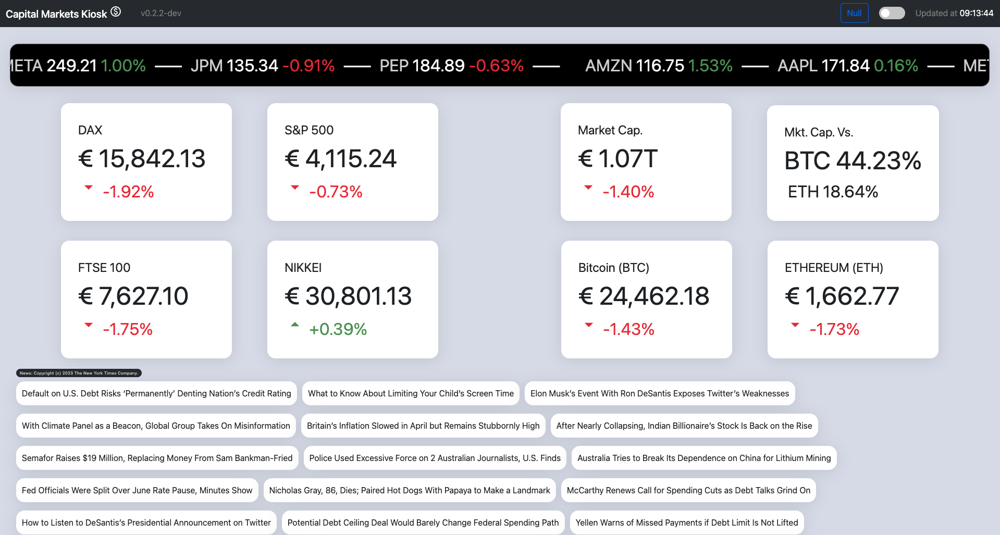

# capital-kiosk
Capital Markets Kiosk Dashboard - PUB

### Daily dose of ca$h

 

 

## Dashboard content:
- Daily stock ticker runner (5 stocks by default)
- Indices: 
    - DAX
    - S&P500
    - FTSE100
    - NIKKEI
- Crypto:
    - Global crypto market cap.
    - BTC vs. ETH market cap. percentage
    - BTC price
    - ETH price
- NY Times daily news (top stories business)

 

## Features:
- Customizable content
- Comprehensive error alerts with animations and logging
- animated placeholders (refresh/error)
- light & dark mode with switch
- Shows branch after version number if not prod (main), e.g. when running development version or WIP branches

## Setup
- API keys for Alphavantage and NYTimes news are to be set as ENV vars 
(put into .bashrc or .zshrc, replace with your keys)
    - `ApiKeyAlphavantage=a48c6e0b7b6bc67451a9a10c8f58425e`
    - `ApiKeyNYTimes=784e870207efe4da7b6fe84b0d390e34`